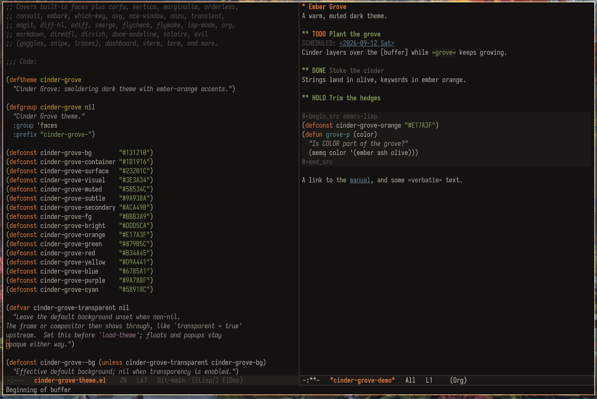
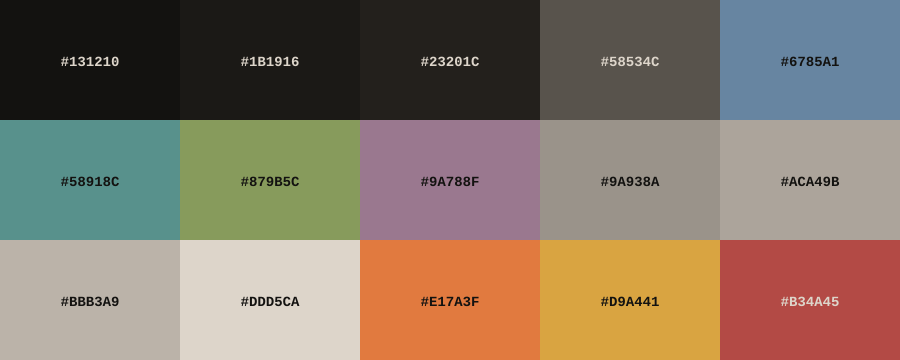

# cinder-grove.el

A warm, muted theme for Emacs 30.1 or later.



## Ports

- [Neovim](https://github.com/aileks/cinder-grove.nvim)
- [VS Code](https://github.com/aileks/cinder-grove)
- [GTK](https://github.com/aileks/cinder-grove-gtk)

## Features

- Built-in faces: editing, search, completions, dired, info, ediff, smerge, whitespace, compilation, and more
- Full font-lock coverage including the Emacs 30 faces used by tree-sitter major modes
- Org (with Doom's extra todo faces) and Markdown
- Package faces for corfu, vertico, marginalia, orderless, consult, and embark
- Git and diff: magit, diff-hl, ediff, smerge, and git-timemachine
- Diagnostics for flycheck and flymake, plus Eglot highlights and inlay hints
- lsp-mode: highlights, breadcrumbs, inlay hints, and semantic tokens
- Doom Emacs surroundings: doom-modeline, solaire, dashboard, which-key, hl-todo, nav-flash, transient, avy, ace-window, anzu, and evil plugins (goggles, snipe, traces)
- diredfl, dirvish, and nerd-icons
- ANSI-colored output, vterm, and term with the Cinder Grove 16-color terminal palette
- Optional transparency
- Theme faces are inert for packages that aren't installed, so no setup beyond loading the theme is needed

## Installation

Doom Emacs (`packages.el` and `config.el`):

```elisp
(package! cinder-grove :recipe (:host github :repo "aileks/cinder-grove.el"))
```

```elisp
(setq doom-theme 'cinder-grove)
```

use-package with straight.el:

```elisp
(use-package cinder-grove-theme
  :straight (:host github :repo "aileks/cinder-grove.el")
  :config (load-theme 'cinder-grove t))
```

Manually, after cloning the repository:

```elisp
(add-to-list 'custom-theme-load-path "/path/to/cinder-grove.el")
(load-theme 'cinder-grove t)
```

Or copy `cinder-grove-theme.el` into `~/.emacs.d/themes/` (or `$DOOMDIR/themes/` in Doom) and load it from there.

## Configuration

Use the terminal's background while keeping explicit backgrounds for popups:

```elisp
(setq cg-transparent t)
(load-theme 'cinder-grove t)
```

`cg-transparent` is also available through `M-x customize-group RET cinder-grove`. Reload the theme after changing it.

GUI frames always use the theme's dark background. For GUI transparency, set the frame's `alpha-background` separately; this works independently of `cg-transparent`:

```elisp
(add-to-list 'default-frame-alist '(alpha-background . 85))
```

This example applies to new frames. The theme does not change frame opacity or frame defaults. Child-frame opacity depends on the package creating it.

## Palette



## License

[GPL-3.0-or-later](./LICENSE)
